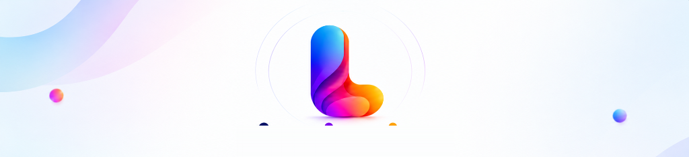
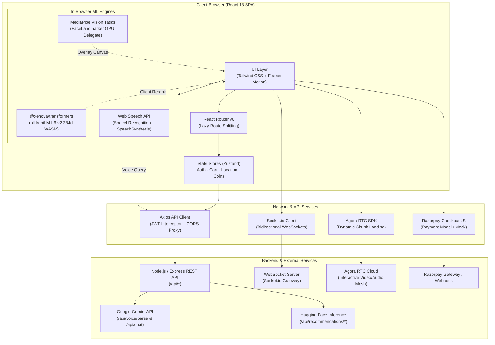

<p align="center">
  
</p>

<h1 align="center">Lokaly (Frontend)</h1>

<p align="center">
  <strong>Shop. Connect. Grow Together.</strong>
</p>

<p align="center">
  A live social-commerce platform engineered for Indian artisans, local craftsmen, and neighborhood merchants — featuring interactive live broadcasts, video reel commerce, multilingual voice shopping, in-browser AR try-on, and hyperlocal discovery.
</p>

<p align="center">
  <a href="https://react.dev/"></a>
  <a href="https://vitejs.dev/"></a>
  <a href="https://tailwindcss.com/"></a>
  <a href="https://www.agora.io/"></a>
  <a href="https://socket.io/"></a>
  <a href="https://huggingface.co/docs/transformers.js"></a>
  
</p>

---

## Table of Contents

- [Overview & Product Vision](#overview--product-vision)
- [System Architecture](#system-architecture)
- [Core Feature Matrix](#core-feature-matrix)
- [Deep-Dive: Key Technical Subsystems](#deep-dive-key-technical-subsystems)
  - [1. Real-Time Interactive Live Streaming](#1-real-time-interactive-live-streaming)
  - [2. Multilingual Voice-First Shopping Engine](#2-multilingual-voice-first-shopping-engine)
  - [3. In-Browser Computer Vision AR Try-On](#3-in-browser-computer-vision-ar-try-on)
  - [4. Client-Side On-Device Vector Embeddings](#4-client-side-on-device-vector-embeddings)
  - [5. Hyperlocal Geolocation & Pincode Routing](#5-hyperlocal-geolocation--pincode-routing)
  - [6. Trust Graph & Multi-Signal Seller Scoring](#6-trust-graph--multi-signal-seller-scoring)
  - [7. Gamified Tokenomics & Community Coins](#7-gamified-tokenomics--community-coins)
  - [8. Co-Host Marketplace & Creator Studio](#8-co-host-marketplace--creator-studio)
- [Technology Stack](#technology-stack)
- [Repository Structure](#repository-structure)
- [Backend API Contract](#backend-api-contract)
- [Environment Configuration](#environment-configuration)
- [Getting Started](#getting-started)
- [Build, Performance & Deployment](#build-performance--deployment)
- [Current Engineering Status & Limitations](#current-engineering-status--limitations)
- [Related Repository](#related-repository)

---

## Overview & Product Vision

### The Problem
Traditional Indian e-commerce platforms (Amazon, Flipkart) are built for standardized, mass-manufactured inventory. In this ecosystem, local artisans (handloom weavers in Varanasi, blue pottery artisans in Jaipur, organic pickle makers in Indore) struggle because:
1. **Catalog Blindness**: Flat 2D photo grids strip out the human narrative, cultural heritage, and craftsmanship behind handmade items.
2. **Language Barriers**: E-commerce interfaces are predominantly English-first or poorly translated, excluding non-English speaking regional buyers and sellers.
3. **Buyer Skepticism**: Unbranded regional crafts face heavy trust deficits regarding authenticity, shipping timelines, and return policies.
4. **Visibility Disadvantage**: Small regional merchants cannot compete against venture-backed brands running aggressive ad auctions.

### The Lokaly Solution
Lokaly transforms regional trade into an interactive, communal experience:
- **Interactive Live Selling**: Streamed directly from workshop floors with live chat, flash discounts, live product pinning, and interactive roulette games.
- **Short-Form Reel Feed**: An Instagram/TikTok-style video commerce feed where buyers discover products through 15-second creator stories and buy directly from the video overlay.
- **Hinglish Voice Commerce**: Voice-driven conversational search and ordering across 14 Indian languages, parsing complex vernacular queries into structured cart actions.
- **Web-Based AR Virtual Try-On**: Real-time facial landmark tracking via MediaPipe to preview handcrafted accessories without installing native mobile applications.
- **Hyperlocal Geofencing**: GPS and 6-digit PIN code matching with customizable search radiuses (5–50 km) to support neighborhood artisans with same-day/next-day logistics.
- **Transparent Trust Graph**: Multi-signal algorithmic verification (fraud karma, on-time fulfillment, customer review sentiment, and repeat buyers) displayed openly to buyers.

---

## System Architecture

Lokaly-Frontend functions as an SPA communicating with a backend API cluster, real-time WebSocket servers, Agora WebRTC media gateways, and client-side WebAssembly ML models:



---

## Core Feature Matrix

| Feature | Primary Route | Implementation Details | Key Dependencies |
| :--- | :--- | :--- | :--- |
| **Interactive Feed** | `/feed` | Infinite video reel & photo feed with likes, bookmarking, comments, share, and direct product tagging. Supports tab filters: *All*, *Following*, *Trending*, *Nearby*. | `DirectMediaUploader`, `Framer Motion`, `react-hot-toast` |
| **Live Selling Studio** | `/live`, `/live/:id` | Host broadcasting & viewer stream playback, real-time live comments, animated emoji bursts, pinned product flash sales, and live Spin-the-Wheel game. | `agora-rtc-sdk-ng`, `socket.io-client`, `react-custom-roulette`, `canvas-confetti` |
| **Voice-First Shopping** | `/voice`, Global Panel | 14 Indian languages voice recognition, audio waveform feedback, Gemini intent extraction (`/api/voice/parse`), text-to-speech confirmation, auto-checkout. | `react-speech-recognition`, `SpeechSynthesis`, `Framer Motion` |
| **AI Shopper Assistant** | Global Panel | Floating draggable AI assistant combining client-side MiniLM embeddings, cosine similarity reranking, price-to-quality scoring, and anchor product memory. | `@xenova/transformers`, `CardStack`, `PurchasePreview` |
| **Virtual AR Try-On** | `/ar-tryon` | Real-time browser-based eyewear try-on using webcam feed, 478 face landmarks, dynamic 3D scale/rotation, and instant 1-tap cart addition. | `@mediapipe/tasks-vision`, HTML5 Canvas |
| **Hyperlocal Explorer** | `/`, `/products` | GPS geolocation with 6-digit Indian PIN code fallback, dynamic radius selector (5, 10, 25, 50 km), seller distance calculations, and delivery ETA chips. | `useGeolocation`, `locationStore`, `NearbySellers` |
| **Seller Dashboard** | `/dashboard` | Comprehensive seller portal: revenue statistics, inventory CRUD with multi-image uploads, order fulfillment tracker, live stream scheduling, and trust analytics. | `ProductFormModal`, `MediaUploader`, `TrustGraph`, `dayjs` |
| **Buyer Hub** | `/buyer/dashboard` | Buyer profile management, live order tracking, address book, wishlist management, review submission, and coin transaction history. | `useCartStore`, `useCoinsStore`, `VerifiedBadge` |
| **Community Coins** | `/coins` | Full transaction ledger of earned tokens (reviews, referrals, live games, wheel spins) and redemption history with animated counter. | `CountUp`, `useCoinsStore`, `Reveal` |
| **Seller Leaderboard** | `/leaderboard` | City-wise rankings across 60+ Indian cities highlighting verified artisans, trust metrics, karma ratings, and total community impact. | `Avatar`, `VerifiedBadge`, `Tilt` |
| **Order Tracking & Invoice** | `/order/:id` | 8-stage visual fulfillment progress timeline with in-browser generated printable/downloadable tax invoice. | `dayjs`, Native Browser Print Stylesheet |
| **Co-Host Marketplace** | `/cohosts`, `/collab/:id` | Creator marketplace for artisans to discover and book live selling influencers, manage calendar slots, and run collaborative co-selling rooms. | `cohostApi`, `BookCoHostModal`, `MyBookingsDrawer` |
| **Story to Reel Creator** | `/story-to-reel` | In-browser promotional video creator converting single product photographs into 15-second animated reels with music moods and styled captions. | `Framer Motion`, `DirectMediaUploader` |
| **Multilingual Switcher** | Global Navbar | Zero-dependency cookie-based Google Translate widget integration enabling translation across 12 scheduled Indian languages. | `googleTranslate.js` |

---

## Deep-Dive: Key Technical Subsystems

### 1. Real-Time Interactive Live Streaming
- **Media Transport**: Powered by Agora RTC Web SDK (`agora-rtc-sdk-ng`). The SDK is dynamically loaded via `import()` only when entering live routes, avoiding a 1.5MB bundle penalty on other pages.
- **Audio/Video Encoding**: Audio is configured with `music_standard` encoding profile to preserve ambient workshop sounds, while video encodes at `720p_2` using VP8 codec.
- **Dual-Channel WebSockets**: While WebRTC handles video/audio streams, a concurrent Socket.io channel handles:
  - Sub-second live chat and host announcements.
  - Floating emoji reaction bursts (`❤️`, `🔥`, `😍`, `✨`) rendered via Framer Motion.
  - Product pinning: When a host features an item, viewers receive a synchronized interactive banner allowing 1-click cart insertion.
  - Stream-wide gamification: Spin-the-Wheel triggers broadcast live prize animations across all connected viewers.

### 2. Multilingual Voice-First Shopping Engine
- **Vernacular Speech Recognition**: Sits on top of the browser's `SpeechRecognition` API via `react-speech-recognition`, supporting 14 Indian locales:
  - Hindi (`hi-IN`), Indian English (`en-IN`), Tamil (`ta-IN`), Bengali (`bn-IN`), Gujarati (`gu-IN`), Marathi (`mr-IN`), Telugu (`te-IN`), Kannada (`kn-IN`), Malayalam (`ml-IN`), Punjabi (`pa-IN`), Odia (`or-IN`), Assamese (`as-IN`), Urdu (`ur-IN`), Sanskrit (`sa-IN`).
- **Natural Language Intent Extraction**: Audio transcripts are submitted to `/api/voice/parse`, where an LLM (Google Gemini) parses natural mixed-language (Hinglish) inputs into structured parameters:
  ```json
  {
    "action": "buy_now",
    "keywords": "blue silk saree",
    "budget_max": 2500,
    "location": "Indore",
    "urgency": "high",
    "spoken_response": "Indore ke top 3 Banarasi blue saree 2500 ke andar mil gayi hain."
  }
  ```
- **Speech Synthesis (TTS)**: The returned `spoken_response` is immediately synthesized via the browser's native `window.speechSynthesis` in the selected locale.
- **Automated Workflow**: If the intent resolves to `add_to_cart` or `buy_now`, the frontend links it to the active product anchor, updates `useCartStore`, and auto-navigates to `/checkout?product=<id>`.

### 3. In-Browser Computer Vision AR Try-On
- **Zero-Install Augmented Reality**: Implemented inside `src/pages/ARTryOn.jsx` using `@mediapipe/tasks-vision`.
- **Dynamic CDN Initialization**: Loads the MediaPipe vision wasm fileset and `face_landmarker.task` bundle with GPU delegation directly into browser memory.
- **Geometric Landmark Tracking**: Tracks eye corners, pupillary distance, and nose bridge coordinates across 60 FPS animation frames.
- **Vector Projection**: Calculates real-time scale, interpupillary distance, and head tilt angles to transform and render SVG frame designs (Aviator, Wayfarer, Cat-Eye) seamlessly over the webcam video canvas.

### 4. Client-Side On-Device Vector Embeddings
- **Zero-API-Key Local ML**: Located in `src/features/aiShopper/embeddings.js`, Lokaly embeds `@xenova/transformers` directly in the browser.
- **Feature Extraction**: Dynamically loads `Xenova/all-MiniLM-L6-v2` compiled for WebAssembly / ONNX runtime, producing 384-dimensional dense vectors from text inputs.
- **Client-Side Cosine Reranking**: When products are retrieved from server searches, the client re-ranks them against the user's specific context using local vector dot products:
  $$\text{Cosine Similarity} = \frac{\mathbf{u} \cdot \mathbf{v}}{\|\mathbf{u}\|_2 \|\mathbf{v}\|_2}$$
- **Composite Best Buy Score**: Results are ranked by a composite formula:
  $$\text{Score} = 0.65 \times (\text{Semantic Match}) + 0.35 \times (\text{Price Quality})$$

### 5. Hyperlocal Geolocation & Pincode Routing
- **Dual-Resolution Geofencing**: Coordinates are captured via `navigator.geolocation` or resolved from a 6-digit Indian Postal Code.
- **Persistence**: Managed through `useLocationStore` with Zustand `persist` middleware in `localStorage`, retaining radius filters and coordinates between sessions.
- **Dynamic Range Filtering**: Automatically sends `lng`, `lat`, and `radiusKm` (5km, 10km, 25km, 50km) query parameters to `/api/hyperlocal/sellers/nearby` and `/api/hyperlocal/products/trending`.

### 6. Trust Graph & Multi-Signal Seller Scoring
- **Radial Ring Visualization**: Implemented in `src/components/TrustGraph.jsx`, generating concentric SVG rings representing 4 core metrics:
  - **Trust Score** (0–100 scale, color-coded: Green $\ge 80$, Amber $\ge 60$, Coral $< 60$).
  - **Fraud Karma** (0–100 risk mitigation index).
  - **Rating Reliability** (Normalized customer rating out of 5 stars).
  - **On-Time Fulfillment Rate** (Percentage of orders dispatched within SLA).
- **Secondary Signals**: Accompanied by breakdown metrics showing verified review counts and repeat buyer percentage.

### 7. Gamified Tokenomics & Community Coins
- **Reward Engine**: Community Coins are awarded to buyers for high-value actions:
  - Leaving detailed product reviews.
  - Providing helpful answers in Q&A sections.
  - Participating in live stream roulette games (`SpinTheWheel.jsx`).
  - Order cashbacks and successful friend referrals.
- **Checkout Redemption**: Users can apply accumulated coins at checkout to receive immediate price reductions, tracked securely via `coinsStore` and synchronized with `/api/orders`.

### 8. Co-Host Marketplace & Creator Studio
- **Creator Discovery**: Allows local artisans who are uncomfortable on camera to hire experienced live presenters through a dedicated directory (`/cohosts`).
- **Slot Booking**: Artisans can view calendar availability and book scheduled live selling sessions with custom commission terms.
- **Story-to-Reel Generator**: A built-in studio (`/story-to-reel`) enabling sellers to upload static product images, select an audio vibe (Dhol Jhooma, Veena Groove, Hinglish Indie), and produce an animated 9:16 video reel with auto-timed marketing captions.

---

## Technology Stack

### Core Framework & Build
- **React 18.3.1**: Modern concurrent rendering, hooks, and lazy loading.
- **Vite 5.4.0**: Sub-second Hot Module Replacement (HMR) and optimized Rollup builds.
- **React Router DOM 6.26.0**: Declarative nested routing, dynamic URL query parameters, and protected routes.

### Styling & Animation
- **Tailwind CSS 3.4.10**: Utility-first responsive design system with customized pastel palette and dark mode tokens.
- **Framer Motion 11.3.0**: Complex layout animations, gesture-based dragging, modal transitions, and SVG paths.
- **Lottie React 2.4.0**: Vector animations for celebration and empty states.
- **Canvas Confetti 1.9.4 & React Confetti 6.1.0**: Milestone celebration bursts.
- **React Icons 5.3.0**: Heroicons 2, Tabler Icons, Feather Icons, and FontAwesome icons.

### State & Networking
- **Zustand 5.0.13**: Lightweight global state management with `persist` middleware.
- **Axios 1.7.0**: Promise-based HTTP client with request/response interceptors for automatic JWT authentication and centralized error handling.
- **Socket.io Client 4.7.5**: WebSocket client supporting auto-reconnection and custom event binding.

### Media & Machine Learning
- **Agora RTC SDK NG 4.24.3**: Low-latency interactive WebRTC video and audio transmission.
- **@xenova/transformers 2.17.2**: On-device transformer models running inside browser WebAssembly.
- **@mediapipe/tasks-vision**: Google MediaPipe vision models for facial landmark extraction.
- **React Speech Recognition 4.0.1 & Regenerator Runtime 0.14.1**: Speech-to-text bridge for Web Speech APIs.

### Payments & Utilities
- **Razorpay Checkout**: Script injection helper for Razorpay payment modal with mock fallback.
- **Day.js 1.11.12**: Lightweight date parsing and formatting.
- **React Hot Toast 2.4.1**: Accessible notification toasts.
- **React Custom Roulette 1.4.1**: Canvas roulette wheel for live games.
- **React Masonry CSS 1.0.16**: Pinterest-style masonry grids for marketplace catalogs.

---

## Repository Structure

```
Lokaly-Frontend/
├── public/
│   └── favicon.svg                  # SVG application favicon
├── src/
│   ├── components/                  # Shared presentation & feature components
│   │   ├── animations/              # Framer Motion animated wrappers (Tilt, Reveal, Magnetic, Marquee)
│   │   ├── chat/                    # Start chat & conversation starter modals
│   │   ├── cohost/                  # Co-host booking modals & scheduling drawers
│   │   ├── home/                    # Homepage specialized cards (LiveSellerCard)
│   │   ├── layout/                  # MainLayout, Navbar, Footer
│   │   ├── seller/                  # Seller product creation/editing modal
│   │   ├── ui/                      # Base primitives (Button, Input, Modal, Badge, Spinner, etc.)
│   │   ├── ChatbotWidget.jsx        # Floating multi-turn AI shopping assistant widget
│   │   ├── ProductCard.jsx          # Reusable product card with price, tags, and wishlist toggle
│   │   ├── SpinTheWheel.jsx         # Live stream roulette prize game
│   │   └── TrustGraph.jsx           # Concentric SVG trust score visualization
│   ├── context/
│   │   ├── NotificationContext.jsx  # WebSocket real-time notification provider & unread state
│   │   └── ThemeContext.jsx         # Light / dark mode theme provider
│   ├── features/
│   │   ├── aiShopper/               # AIShopperPanel, on-device embeddings.js, VoiceMicButton
│   │   ├── coins/                   # Coins balance indicator widget
│   │   └── hyperlocal/              # NearbySellers rail & LocationPrompt modal
│   ├── hooks/
│   │   ├── useAgoraHoverPreview.js  # Live stream preview on card hover
│   │   ├── useFeaturedStreams.js    # Hook polling active live stream sessions
│   │   └── useGeolocation.js        # Browser GPS coordinate request hook
│   ├── lib/
│   │   ├── cn.js                    # Class name concatenation utility
│   │   └── googleTranslate.js       # Zero-dependency Google Translate cookie bridge
│   ├── pages/                       # Route pages (lazy loaded in routes.jsx)
│   │   ├── ARTryOn.jsx              # MediaPipe-powered virtual eyewear try-on
│   │   ├── BuyerDashboard.jsx       # Buyer orders, wishlist, profile, and coins hub
│   │   ├── Cart.jsx                 # Shopping cart view with item controls
│   │   ├── Checkout.jsx             # Address form, coin redemption, Razorpay integration
│   │   ├── CoHosts.jsx              # Co-host marketplace and profile directory
│   │   ├── CollabRoom.jsx           # Collaborative group-shopping experience
│   │   ├── Dashboard.jsx            # Seller dashboard (Analytics, Inventory, Orders)
│   │   ├── Feed.jsx                 # Video reel & photo social commerce feed
│   │   ├── Home.jsx                 # Marketing landing page & discovery portal
│   │   ├── Leaderboard.jsx          # City-wise artisan trust leaderboard
│   │   ├── LiveStream.jsx           # Live broadcast streaming & viewer room
│   │   ├── Messages.jsx             # Real-time 1-on-1 buyer-seller messaging
│   │   ├── OrderTrack.jsx           # 8-stage timeline fulfillment tracker + invoice PDF
│   │   ├── ProductDetail.jsx        # Product gallery, specifications, and reviews
│   │   ├── Products.jsx             # Marketplace catalog search & filter
│   │   ├── StoryToReel.jsx          # Product-to-reel video generator studio
│   │   ├── VoiceShop.jsx            # Dedicated vernacular voice shopping page
│   │   └── VerifyEmail.jsx          # OTP & token email verification
│   ├── routes/
│   │   ├── ProtectedRoute.jsx       # Auth guard checking login status and user roles
│   │   └── routes.jsx               # Lazy route definitions
│   ├── services/
│   │   ├── agora.js                 # Agora RTC SDK lazy loader & track factory
│   │   ├── api.js                   # Configured Axios instance with request/response logging
│   │   ├── cohostApi.js             # Co-host CRUD and calendar booking endpoints
│   │   ├── liveService.js           # Live stream session listing & detail queries
│   │   ├── notificationService.js   # Notification queries and mark-read actions
│   │   ├── razorpay.js              # Script injection for Razorpay Checkout
│   │   └── socket.js                # Singleton Socket.io connection manager
│   ├── store/
│   │   ├── aiShopperStore.js        # State for AI Shopper panel visibility
│   │   ├── authStore.js             # Persistent JWT token and user profile
│   │   ├── cartStore.js             # Cart items, counts, and subtotal
│   │   ├── coinsStore.js            # Coin balance and transaction ledger
│   │   ├── locationStore.js         # GPS coordinates, pincode, and search radius
│   │   ├── uiStore.js               # Global modal toggles
│   │   └── wishlistStore.js         # Local storage backed saved item IDs
│   ├── App.jsx                      # App root with ThemeProvider, routes, global widgets
│   ├── index.css                    # Tailwind directives, CSS variables, global resets
│   ├── main.jsx                     # React DOM entry point
│   └── routes.jsx                   # Central route exports
├── .env.example                     # Environment configuration reference
├── index.html                       # HTML5 entry with Google Fonts and meta tags
├── package.json                     # Project manifest and scripts
├── tailwind.config.js               # Tailwind custom design tokens and keyframes
├── vercel.json                      # Vercel deployment rewrite rules
└── vite.config.js                   # Vite server, dev proxies, and Rollup chunking
```

---

## Backend API Contract

The frontend expects a companion REST + WebSocket backend supporting the following endpoints:

### Authentication & Profiles
- `POST /api/auth/signup` — Registers a new user (`buyer` or `seller` with shop details).
- `POST /api/auth/login` — Authenticates user, returning `{ token, user }`.
- `GET /api/auth/me` — Hydrates session on startup using Bearer token.
- `POST /api/auth/verify-email` — Confirms email via OTP or token.

### Catalog & Hyperlocal
- `GET /api/products` — Catalog query with filters (`category`, `city`, `price`, `search`).
- `GET /api/products/:id` — Single product details including seller metadata.
- `POST /api/products` — Creates product listing (Seller only).
- `GET /api/hyperlocal/sellers/nearby` — Lists sellers within `radiusKm` of coordinates.
- `GET /api/hyperlocal/products/trending` — Trending products based on locality and 7-day signals.

### Cart, Orders & Payments
- `GET /api/cart` — Fetches user cart contents and computed subtotal.
- `POST /api/cart/add` — Adds product ID and quantity to cart.
- `PATCH /api/cart/update` — Adjusts item quantity.
- `DELETE /api/cart/item/:productId` — Removes item from cart.
- `POST /api/orders` — Submits order with shipping address and coin deductions.
- `POST /api/payments/order/:orderId/razorpay` — Creates Razorpay order ID.
- `POST /api/payments/verify` — Validates Razorpay HMAC signature.

### Live Streaming & Real-Time
- `GET /api/live/featured` — Active broadcast sessions for homepage rail.
- `GET /api/live/sessions` — Lists live sessions by status.
- `GET /api/live/sessions/:id` — Fetches stream credentials and Agora channel tokens.
- `GET /api/chat/conversations` — Direct messaging conversation threads.
- `GET /api/notifications` — Notification inbox with pagination and unread counts.

### AI & Recommendations
- `POST /api/voice/parse` — Parses natural language/Hinglish speech into structured intent.
- `POST /api/chat` — Multi-turn LLM shopping assistant response.
- `POST /api/recommendations/search` — Semantic catalog search.
- `GET /api/recommendations/for-you` — Personalized product suggestions.
- `GET /api/recommendations/similar/:id` — Nearest-neighbor product recommendations.

---

## Environment Configuration

Create a `.env` or `.env.local` file in the project root:

```bash
cp .env.example .env.local
```

### Environment Variables Reference

| Variable | Required | Description | Default / Example |
| :--- | :---: | :--- | :--- |
| `VITE_API_URL` | **Yes** | Fully qualified base URL of the backend REST API | `http://localhost:5050/api` |
| `VITE_SOCKET_URL` | Optional | WebSocket server endpoint for Socket.io | `http://localhost:5000` |
| `VITE_AGORA_APP_ID` | Optional* | Agora App ID for video broadcasting (*required for `/live` streams) | `your_agora_app_id` |

> [!NOTE]
> Vite only exposes environment variables prefixed with `VITE_` to client-side code. Do not store private API keys or database secrets in this file, as all values will be included in the compiled JavaScript bundle.

---

## Getting Started

### Prerequisites
- **Node.js**: v18.0.0 or higher
- **Package Manager**: `npm` (v9+) or `pnpm`
- **Modern Browser**: Chrome, Edge, Safari, or Firefox with WebRTC, WebGL, and MediaDevices support.

### Installation

1. Clone the repository:
   ```bash
   git clone https://github.com/sanskarchourasiya445/Lokaly-Frontend.git
   cd Lokaly-Frontend
   ```

2. Install dependencies:
   ```bash
   npm install
   ```

3. Configure environment variables:
   ```bash
   cp .env.example .env.local
   # Update VITE_API_URL and VITE_AGORA_APP_ID if testing live broadcasts
   ```

4. Launch the local development server:
   ```bash
   npm run dev
   ```
   The application will be accessible at `http://localhost:5173`.

---

## Build, Performance & Deployment

### Production Build
To create an optimized, minified production build:

```bash
npm run build
```

To preview the built production artifacts locally:
```bash
npm run preview
```

### Build Optimization & Code Splitting
The project utilizes Rollup manual chunking inside `vite.config.js` to ensure optimal caching and prevent monolithic vendor bundles:
- `react-vendor`: `react`, `react-dom`, `react-router-dom`
- `animation-vendor`: `framer-motion`, `lottie-react`, `canvas-confetti`, `react-confetti`
- `i18n-vendor`: `i18next`, `react-i18next`, `i18next-browser-languagedetector`
- Heavy dependencies such as `agora-rtc-sdk-ng` and `@xenova/transformers` are loaded dynamically on demand using ES dynamic `import()`.

### Deployment

#### Vercel Deployment
The repository includes `vercel.json` configured for Single Page Applications:
```json
{
  "rewrites": [
    { "source": "/((?!api/).*)", "destination": "/index.html" }
  ]
}
```
1. Import repository into Vercel.
2. Framework Preset: **Vite**.
3. Build Command: `npm run build`.
4. Output Directory: `dist`.
5. Set `VITE_API_URL` to your production backend URL.

---

## Current Engineering Status & Limitations

To maintain architectural transparency:

1. **Backend Coupling**: This repository represents the client frontend. Full functionality (authentication, cart persistence, payment signature verification, order placement, live Agora token issuing) requires a running backend instance.
2. **Speech Recognition Browser Support**: Voice shopping relies on the browser's native `SpeechRecognition` API. It functions optimally on Chromium-based browsers (Chrome, Edge) and newer Safari versions. On unsupported platforms, the UI displays a disabled state.
3. **Automated Test Coverage**: The repository currently does not include automated unit (Vitest/Jest) or end-to-end (Playwright/Cypress) test suites. Tests should be prioritized for the cart calculations, checkout payment flows, and voice intent fallback states.
4. **Local Razorpay Mock Mode**: When running against development backends without active Razorpay payment gateway credentials, the checkout flow falls back to a sandbox mock verification mode (`rp.mock = true`).

---

## Related Repository

**Lokaly Backend**: [https://github.com/sanskarchourasiya445/Lokaly-Backend](https://github.com/sanskarchourasiya445/Lokaly-Backend) — Node.js, Express, MongoDB, Socket.IO, `@xenova/transformers`.

---

*Engineered with focus on craftsmanship, local livelihoods, and regional Indian commerce.*
